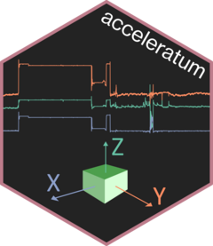

# acceleratum 

An R package to aid in bench calibration of triaxial accelerometery devices.  

Install with
```
remotes::install_github("loregalle/acceleratum",
                        build_vignettes = TRUE,
                        force = TRUE)
```

Get started with `vignette("acceleratum", package = "acceleratum")`  

Note that building the vignette requires a LaTeX installation. If
you don't have one you can try:
```
tinytex::install_tinytex()
```

Or you can avoid building the vignette and download the pdf from the
`inst` folder.

Currently in early development stages, be aware of bugs and possible
future changes.
