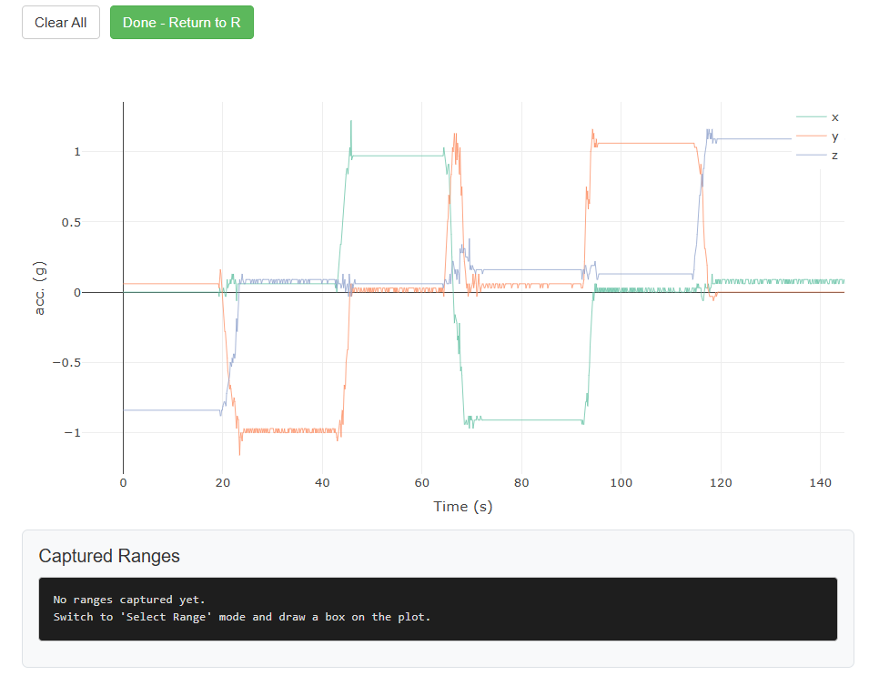
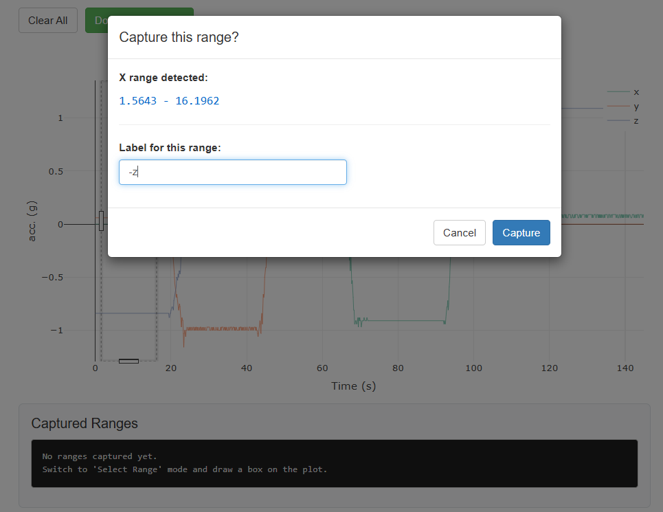
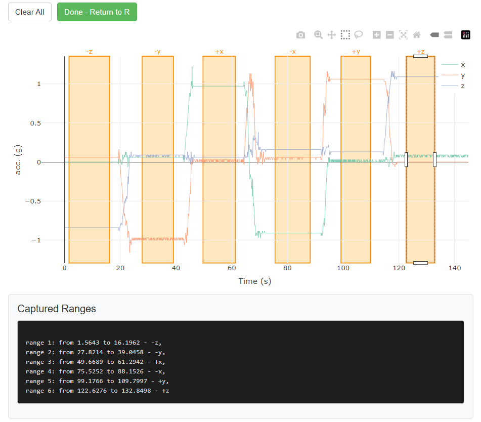

```{css, echo = FALSE}
/* Retained from previous html version. Keep in case I feel like switching
back */
.help-file {
  outline-style: dashed;
  outline-color: #aaa;
}

div.sourceCode {
  outline-style: solid;
  outline-color: #aaa;
  outline-width: 1px;
}
```

```{r, include = FALSE}
knitr::opts_chunk$set(
  collapse = TRUE,
  comment = "#>"
)
```

# Scope of the package
`acceleratum` has been developed to aid with bench calibration of (triaxial)
accelerometer devices prior to field deployment. While originally developed
and used in a biologging context, its application are not restricted to it.  

A triaxial accelerometer needs calibration to correct systematic errors that
prevent raw measurements from matching true acceleration. In `acceleratum` we
consider three sources of errors that are structural to the device:

*   Scale (S): Each axis may respond differently to the same acceleration
(e.g., +1g on the x-axis might read as 0.98, while +1g on y reads as 1.02).
Calibration equalizes these sensitivities.
*   Misalignment (M): The sensor's internal axes may not be perfectly orthogonal
(90° apart). This causes cross-talk where acceleration along one axis leaks
into another.
*   Bias (b): Each axis can have a constant offset (e.g., reading 0.1g even
at rest), which must be subtracted to center measurements at zero.

`acceleratum` also allows to correct for mispositioning
of a deployed device due to user error (e.g. a device mounted backwards), and
unavoidable small differences in positioning of a device deployed on
living animals.

While bench calibration of a device is preferred, `acceleratum` also provides
methods to attempt the estimation of calibration parameters from
deployed devices.

```{r setup}
library(acceleratum)
```

# Data format and handling
Functions dealing with parameter estimation are time-agnostic. As such,
these were written to handle data in matrix format.

## The `aclrtm_accelerometery` class
To make it easier to visualise and print matrices of accelerometer data,
`acceleratum` provides a helper class which use is largely optional:
`aclrtm_accelerometery`. An `aclrtm_accelerometery` can be initialised using
the function `accelerometery()`

```{r}
set.seed(42)
some_data <- rnorm(90)
head(some_data)
```

```{r}
# aclrtm_accelerometery from a numeric vector assumes repeating x, y, z order:
# x1, y1, z1, x2, y2, z2, ... , xn, yn, zn
acc <- accelerometery(some_data)
head(acc)
```
```{r}
# aclrtm_accelerometery from matrix
# Note how the vector was now arranged column-wise. That's due to the behaviour
# of matrix() that defaults to byrow = FALSE
some_data <- matrix(some_data, ncol = 3)
acc <- accelerometery(some_data)
head(acc)
```

```{r}
# aclrtm_accelerometery from data.frame
some_data_df <- as.data.frame(some_data)
colnames(some_data_df) <- c("x", "y", "z")
acc <- accelerometery(some_data_df)
head(acc)
```

```{r}
# Plotting method fo aclrtm_accelerometery objects
plot(acc)
```

Optionally, arguments `sampling_rate` and `start_time` can be provided
and will be set as attributes.
When available, subsetting rows will account for the shift.
```{r}
acc <- accelerometery(some_data,
                      axes = "xyz",
                      sampling_rate = 4, # in Hz
                      start_time = as.POSIXct("2026-01-01 10:00:00",
                                              tz = "UTC"))
head(acc, 3)
```

```{r}
acc[20:23,]
```

```{r}
acc[c(10, 14, 17),]
```

When constructing from a data frame, a timestamp column can be provided
```{r}
some_data_df$timestamp <- seq(as.POSIXct("2026-01-01 10:00:00",
                                         tz = "UTC"),
                              by = 1/4,
                              length.out = nrow(some_data_df))

acc <- accelerometery(some_data_df,
                      ts_col = "timestamp")
head(acc)
```

Note that an `aclrtm_accelerometery` object uses attributes `sampling_rate`
and `start_time` just as an aid
in plotting, but does not store the timestamp of each observation and assumes
consistent sampling rate across the data. If your data comes from deployments
that cannot safely assume consistent sampling rate, some precautions must be
taken to align the output of calibration functions with the correct timestamp
stored elsewhere. More on that later.

## The `aclrtm_burst` class
```{r, include = FALSE}
rm(list = ls())
gc()
```

Sometimes, accelerometer data is stored on file in "bursts", with multiple
observations per row. `acceleratum` provides the helper class `aclrtm_burst`
to help with management of such data. Initialised via `burst()`:
```{r}
data(bench) # some data in burst format
```

An extract from `help(bench)`:
```{r, echo = FALSE, class.output="help-file"}
html_to_latex <- function(html_string) {
  infile <- tempfile(fileext = ".html")
  outfile <- tempfile(fileext = ".tex")
  on.exit(unlink(c(infile, outfile)), add = TRUE)
  
  writeLines(html_string, infile)
  rmarkdown::pandoc_convert(input = infile, from = "html", to = "latex", output = outfile)
  paste(readLines(outfile), collapse = "\n")
}

outfile <- tempfile(fileext = ".html")
tools:::Rd2HTML("../man/bench.Rd", out = outfile)
rawHTML <- paste(readLines(outfile), collapse="\n")
unlink(outfile)
rawHTML <- gsub(".*(The <code>accelerations_raw.*burst\\.).*", "\\1", rawHTML)
rawHTML <- paste0('<div class="help-file">', rawHTML, '</div>')
rawLatex <- html_to_latex(rawHTML)
rawLatex <- paste0("\n", rawLatex)
knitr::asis_output(
  paste0(
    "\n\\begin{framed}\n",
    rawLatex,
    "\n\\end{framed}"
  )
)
```

```{r}
brst <- burst(bench, "accelerations_raw", ts_col = "timestamp")
```

```{r}
head(brst)
```

A print method is available for `aclrtm_burst` objects and a
`write_burst()` function is provided to write burst objects to external files.  

An `aclrtm_burst` object can then be converted to `aclrtm_accelerometery` using
`burst_to_accelerometery()` or its alias `b2a()`

```{r}
acc <- b2a(brst)
head(acc)
```

and the inverse operation is possible with `accelerometery_to_burst()` or its
alias `a2b()`
```{r}
brst_new <- a2b(acc, 5)
head(brst_new)
```

Note that converting an `aclrtm_burst` object to `aclrtm_accelerometery` and
back again is not a
lossless round-trip. As noted above, an `aclrtm_accelerometery` object does not
store individual timestamps. Consequently, if the original
aclrtm_burst object had irregular timestamps (e.g. variable gaps between bursts)
or variable burst sizes (i.e. ragged bursts), that information is not
recoverable from the `aclrtm_accelerometery` object alone. The reconstructed burst
object will have uniformly spaced timestamps and equal-sized bursts (except
possibly the last), regardless of the original structure. All additional columns
present in the original object will also be lost.

```{r, include = FALSE}
rm(list = ls())
gc()
```

# Calibration parameter estimation

To showcase how to perform calibration parameter estimation from bench acquired
data we will use the `bench` dataset.
The `bench` dataset includes data from a triaxial accelerometer device mounted
on a cubic frame and rotated through 6 known orientations over about 3 minutes.
Sampling rate is fixed at 8 Hz. The raw data is stored in burst format (see
the previous chapter) in column `accelerations_raw`.
You can consult more information with `help(bench)`.

```{r}
data(bench, package = "acceleratum")
acc <- b2a(burst(bench, "accelerations_raw", "xyz", "timestamp"))
```

```{r}
plot(acc)
```

The easiest way to perform the calibration is to manually select segments in the
data for which the direction of the gravity vector is known. That can be
done interactively with `segment_select()`, which will open a shiny app
locally
```{r, eval = FALSE}
bench_annotations <- segment_select(acc)
```

{width=4in}  

The user can click and drag to select (horizontal) segments of interest
and label them  

{width=4in}  

Then repeat for all other segments.  

{width=4in}  

Click "Done" to close the app and output the result. For ease of use,
we included a small dataset of annotations taken with `segment_select()` on
the `bench` dataset:
```{r}
data(bench_annotations, package = "acceleratum")
bench_annotations
```

Annotations should then be processed on the data to be used as input into
the calibration function.

```{r}
seg_list <- process_annotations(acc, bench_annotations)
```

`cal_accel()` is the main function to estimate calibration parameters given
a list of segments (such as the output of `process_annotations()`).
```{r}
cal_param <- cal_accel(seg_list)
```
```{r}
cal_param
```

Optionally, if all 6 "pure" orientations for a triaxial
accelerometer have been taken (and labelled correctly in the segment list),
`cal_accel()` allows for the simultaneous estimation of calibration
parameter and the tilt of the bench platform
following the closed-form calibration method by
[Xu et al. (2021)](https://doi.org/10.1109/TIM.2020.3026024).
```{r}
cal_param <- cal_accel(seg_list, estimate_tilt = TRUE)
```

```{r}
cal_param
```

The raw data can then be calibrated by:

```{r}
acc_calib <- apply_cal(acc,
                       S = cal_param$S,
                       M = cal_param$M,
                       b = cal_param$bias)

plot(acc_calib) # compare with previous
```

```{r}
# example on field data collected with the same device
data(muskox)

brst_ox <- burst(muskox[1:1000,], # subset rows for showing purposes
                 "accelerations_raw", "xyz", "timestamp")
plot(brst_ox)
```

```{r, include = FALSE}
rm(muskox)
gc(verbose = FALSE)
```

```{r}
# apply_cal works on aclrtm_burst objects
brst_ox_calib <- apply_cal(brst_ox,
                           S = cal_param$S,
                           M = cal_param$M,
                           b = cal_param$bias)
plot(brst_ox_calib)
```

Additionally, with `apply_cal()` it is possible to flip around one axis to
account for a misplaced device. Say, for example, that the device was placed
upside down (rotated 180 degrees around axis x) at deployment:
```{r}
brst_ox_calib_flipped <- apply_cal(brst_ox,
                                   S = cal_param$S,
                                   M = cal_param$M,
                                   b = cal_param$bias,
                                   R = "x")
plot(brst_ox_calib_flipped)
```

```{r, include = FALSE}
rm(list = ls()[!ls() %in% c("cal_param")])
gc()
```


# Rotate to align to gravity
